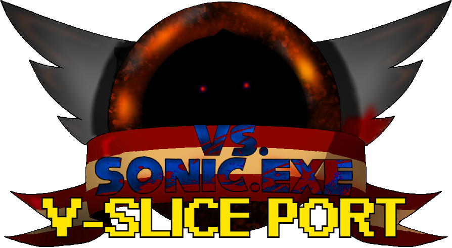

# Versus Sonic.exe V-Slice Port

> ⚠️ **Work in Progress**  
> This mod is a major **W.I.P.** — most, if not everything, is **subject to change**.  
> ❌ **No, I will not cancel the mod.**

---

## 📦 Pack Contents

### ✅ 100% Completed Songs
- **Too Slow**
- **Triple Trouble**
- **Fatality**
- **Personel (Serious)**

### 🔧 Mostly Completed Songs
- **You Can't Run**

### 🚧 Heavily W.I.P. Songs
- **Chaos**  
  _Needs camera work, animations, and events._
- **Final Escape**  
  _Needs transitions, animations, events, and much more._

### ❗Noticed Issues (READ)
> These songs are still fully functional in the grand scheme of things, most of these things shouldn't bother you.

- **Too Slow**  
  _Scaling in Too Slow isn't accurate, and there are missing but not very noticable BG elements_
- **Fatality**  
  _Script fails to load when opening the song at random times, press F5 to reload the script and it will work._
- **Personel (Serious)**  
  _Rank percentage will be 75% (G) no matter if you 100% "Sick!" the song or not._
- **Triple Trouble**  
  _Currently uses old stage assets. (I found this out after I'd already finished the song, Lol.)_

> ⚙️ _Note: All songs still need proper transitions._

---

## 🧩 Other Elements in Progress

- HUD elements  
- Freeplay icons  

> These may not be available until the full mod is complete.

---

## ⚠️ Restored Asset Notice

Some elements in this mod are taken from the **RESTORED** version of the Versus Sonic.exe mod (by Merphi and his team).  
This means **they were not made by the EXE team** and could pose a takedown risk.  
If necessary, I may be required to remove the following songs and/or their assets:

- **Personel (Serious)**
- **More** _(unfinished)_

---

Thanks for checking it out!
